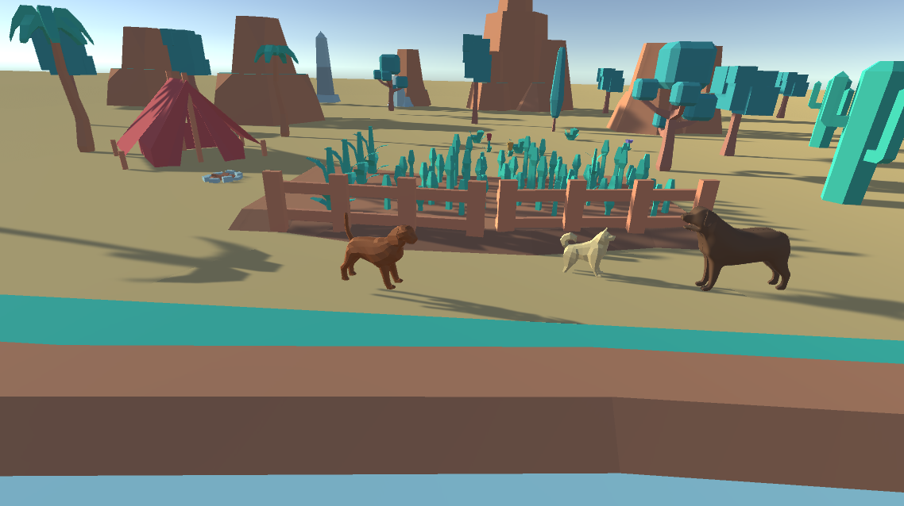
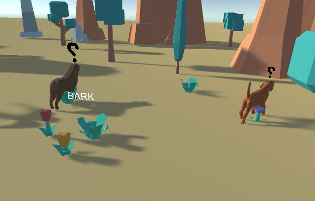
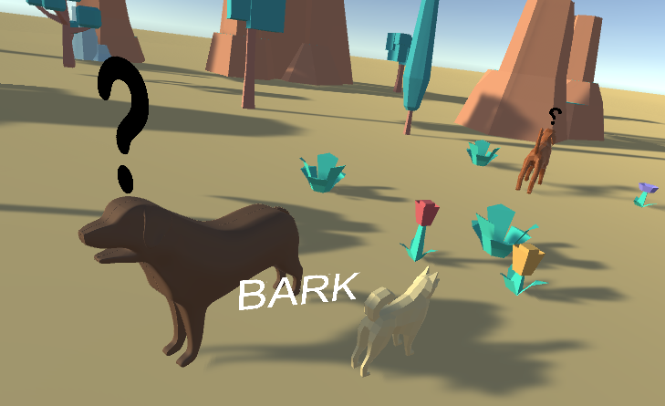

# Desert Island Dogs

This repository contains C# scripts and 3D assets for my game 'Desert Island Dogs' - a game where you manage a desert island dog paradise. This is intended to be a mobile game. 

# Scripts

Scripts can be found in the [Assets/Scripts](./Assets/Scripts) folder.

# Features

- Dog navigation implemented using Unity NavMeshes - dogs currently navigate to randomly chosen locations
- Dogs can perform 'tricks', currently a trick simply displays a text notification of the trick - will be an animation eventually
- Dogs express emotions as emoticon popups
- Simple dog walk cycle animation test

# Planned features

- Manage dog needs and emotions
- Collectible dogs, collect all breeds by discovering them in new locations on the island 
- Dog customisation, discover and craft new items to customise your dogs
- Build furniture and toys that dogs will interact with

# Screenshots

Below are some screenshots of the prototype

Desert island setting

Dogs interact with surrounding objects

Dogs interact with eachother
